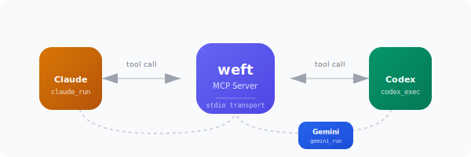

<picture>
  <source media="(prefers-color-scheme: dark)" srcset="assets/logo-weft-dark.svg">
  
</picture>

**Your AI agents can now call each other.**


<br><br>



An MCP server that lets Claude Code, Codex CLI, and Gemini CLI invoke each other as tools. No glue scripts. No copy-paste. Just agents collaborating.

## Why?

Each CLI agent has strengths. Sometimes you want Claude to implement, Codex to review, and Gemini to sanity-check. Weft makes that one tool call away.

## Quick Start

```bash
# Install
git clone https://github.com/cipher982/weft && cd weft
uv sync

# Verify setup (no API calls)
uv run agent-mesh doctor

# Test it works (costs money)
uv run agent-mesh smoke
```

## Register the MCP Server

Pick your agent and register weft:

**Claude Code:**
```bash
claude mcp add-json agent-mesh '{"type":"stdio","command":"uv","args":["run","python","-m","agent_mesh.mcp_server"]}'
```

**Codex:**
```bash
codex mcp add agent-mesh -- uv run python -m agent_mesh.mcp_server
```

**Gemini:** Add to `~/.gemini/settings.json`:
```json
{
  "mcpServers": {
    "agent-mesh": {
      "command": "uv",
      "args": ["run", "python", "-m", "agent_mesh.mcp_server"]
    }
  }
}
```

Now your agent has three new tools: `claude_run`, `codex_exec`, `gemini_run`.

## Prerequisites

Install the CLIs you want to use:

```bash
npm install -g @anthropic-ai/claude-code  # then: claude auth
npm install -g @openai/codex               # needs: OPENAI_API_KEY
npm install -g @google/gemini-cli          # needs: GEMINI_API_KEY
```

## Troubleshooting

| Problem | Fix |
|---------|-----|
| "Command not found" | `which claude codex gemini` - install missing CLIs |
| "Auth failed" | Run `claude auth` or set API key env vars |
| "MCP server not found" | Restart your agent CLI after registering |
| Timeouts | Add `--timeout 300` for long tasks |

## License

MIT
